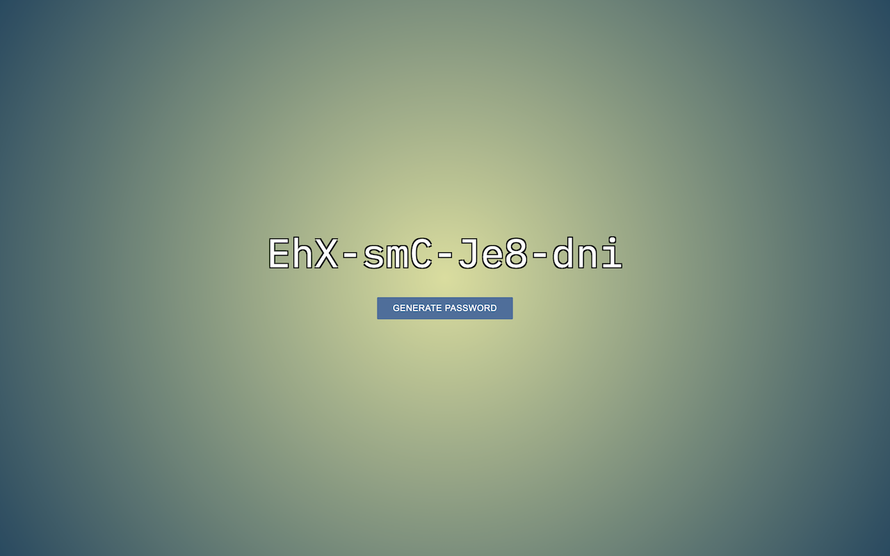

# Random Password Generator

A simple random password generator with a clean and responsive user interface.



## Table of Contents

- [Overview](#overview)
- [Features](#features)
- [Demo](#demo)
- [Usage](#usage)
- [Installation](#installation)
- [Contributing](#contributing)
- [Security Note](#security-note)
- [Acknowledgments](#acknowledgments)
- [License](#license)
- [Author](#author)

## Overview

This project is a random password generator designed to create secure and unique passwords for users. It provides a user-friendly interface with a "Generate Password" button, allowing users to easily obtain strong passwords.

## Features

- Generates random passwords with a mix of uppercase letters, lowercase letters, and numbers.
- Clean and responsive user interface.
- Supports password generation using the "Generate Password" button or by pressing the spacebar.

## Demo

View the live demo on CodePen: [Karl Horning's Portfolio Webpage 2019](https://codepen.io/karlhorning/pen/XBNaWw)

## Usage

To use the random password generator:

1. Open `index.html` in a web browser.
2. Click the "Generate Password" button to get a new random password.
3. Optionally, press the spacebar for quick password generation.

## Installation

1. Clone the repository:

    ```bash
    git clone https://github.com/Karl-Horning/random-password-generator.git
    ```

2. Open `index.html` in a web browser.

## Contributing

Contributions are welcome! If you'd like to contribute to the project, please follow these steps:

1. Fork the repository.
2. Create a new branch.
3. Make your changes and commit them.
4. Push to your fork and submit a pull request.

## Security Note

This project was an earlier project and may not employ the latest security practices. Generating passwords in this way might not be as secure as using modern password hashing and salting techniques. If you are working on a production system, consider using established authentication libraries and frameworks.

## Acknowledgments

- [IBM Plex Mono](https://fonts.googleapis.com/css?family=IBM+Plex+Mono): Google Fonts IBM Plex® is the corporate typeface for IBM worldwide and an open-source project developed by the IBM Brand & Experience team (BX&D).

## License

This project is licensed under the [MIT License](LICENSE).

## Author

Karl Horning: [GitHub](https://github.com/Karl-Horning/) | [LinkedIn](https://www.linkedin.com/in/karl-horning/) | [CodePen](https://codepen.io/karlhorning)